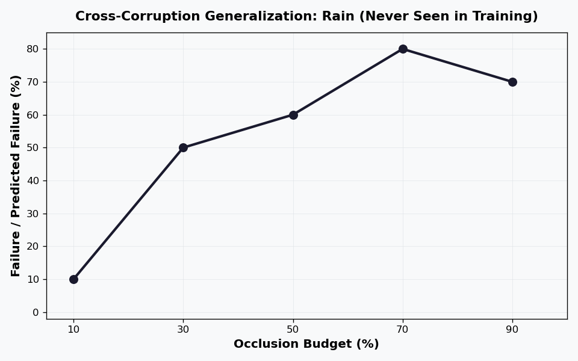
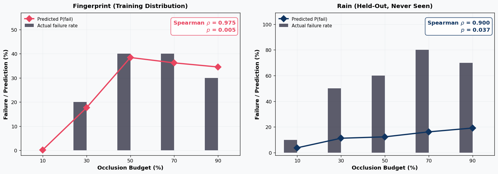

# Robot-Arm-SOTIF

**Visual safety monitor for robot manipulation under camera occlusion.**

A CNN predicts P(failure) from a single camera frame — trained on fingerprint and glare occlusion, it generalizes to detect failures under raindrop occlusion it has never seen.

<p align="center">
  
</p>

## Key Result

A pretrained ResNet-18 backbone (frozen ImageNet features + 33K trainable head) achieves **statistically significant cross-corruption generalization** — trained only on fingerprint/glare, it correctly ranks rain severity by failure probability.

| Metric | CNN from Scratch | ResNet-18 Pretrained |
|--------|:---:|:---:|
| Rain Spearman *ρ* (held-out) | -0.62 | **0.90** (*p* = 0.037) |
| Fingerprint Spearman *ρ* (train) | 0.67 | **0.98** (*p* = 0.005) |

<p align="center">
  
</p>

## How It Works

**Adversarial CMA-ES** finds worst-case occlusion patterns for each corruption type and budget level. A VLM policy ([InternVLA-M1](https://github.com/OpenGVLab/InternVLA)) executes pick-and-place tasks in simulation ([SimplerEnv](https://github.com/simpler-env/SimplerEnv) / SAPIEN) while the camera image is degraded. The safety predictor is trained on (image, success/failure) pairs from these episodes.

```
CMA-ES adversarial search       Camera occlusion models       VLM policy (InternVLA-M1)
  finds worst-case params   -->   fingerprint / glare / rain  -->  pick_coke_can task
                                         |                              |
                                    occluded frame               success / failure
                                         |                              |
                                         v                              v
                                  SafetyNet CNN  ------>  P(failure) vs ground truth
```

<p align="center">
  
</p>

The frozen ResNet-18 backbone provides rich visual features (edges, textures, object structure) learned from 1.2M ImageNet images. Only the classifier head is trained on our ~550 episode samples, avoiding overfitting while enabling corruption-agnostic failure detection.

## Project Structure

```
adversarial_dust/
  config.py              # YAML config loading
  evaluator.py           # Policy evaluation with occlusion
  optimizer.py           # CMA-ES adversarial optimization
  envelope_predictor.py  # Safe operating envelope classification
  safety_predictor.py    # ResNet-18 CNN: image -> P(failure)
  collect_training_data.py  # Episode data collection pipeline
  run_safety_predictor.py   # Full train/eval orchestration
  rain_model.py          # Raindrop occlusion (refraction-based)

configs/
  safety_predictor.yaml  # Pipeline configuration

scripts/
  setup_nvvulkan.sh      # Vast.ai GPU setup (Vulkan + CUDA + deps)
  generate_readme_figures.py  # Regenerate figures from results JSON

tests/
  test_safety_predictor.py  # CNN unit tests
```

## Running the Pipeline

### GPU Setup (Vast.ai)

```bash
# From vastai_runner/ directory
pixi run vastai create instance <OFFER_ID> \
  --image nvidia/vulkan:1.3-470 --disk 80 --ssh --direct \
  --onstart-cmd "bash -c 'curl -sL https://raw.githubusercontent.com/kilojoules/Robot-Arm-SOTIF/main/scripts/setup_nvvulkan.sh -o /root/setup_nvvulkan.sh && bash /root/setup_nvvulkan.sh > /root/setup.log 2>&1'"
```

### Full Pipeline

```bash
# On GPU machine after setup
cd /root/InternVLA-M1
PYTHONPATH=/root/InternVLA-M1 python deployment/model_server/server_policy_M1.py \
  --ckpt_path /root/internvla_m1_ckpt/checkpoints/steps_50000_pytorch_model.pt \
  --port 10093 --use_bf16 &

cd /root/project
PYTHONPATH=/root/InternVLA-M1:/root/project:/root/camera_occlusion \
  python -u adversarial_dust/run_safety_predictor.py \
  --config configs/safety_predictor.yaml
```

The pipeline runs three stages:
1. **Collect** — fingerprint + glare episodes (random + adversarial params)
2. **Train** — ResNet-18 with frozen backbone, class-weighted BCE loss, episode-level split
3. **Evaluate** — rain (held-out generalization) + fingerprint (sanity check)

## SOTIF Context

[SOTIF (ISO 21448)](https://www.iso.org/standard/77490.html) addresses safety of the intended functionality — failures that arise not from hardware faults, but from limitations of perception and decision-making under real-world conditions. Camera occlusion (fingerprints, glare, rain) is a canonical SOTIF trigger.

This project demonstrates that a lightweight visual safety monitor can:
- Detect degraded perception **before** the policy fails
- **Generalize across corruption types** using pretrained visual features
- Be trained with only ~550 samples by leveraging transfer learning
