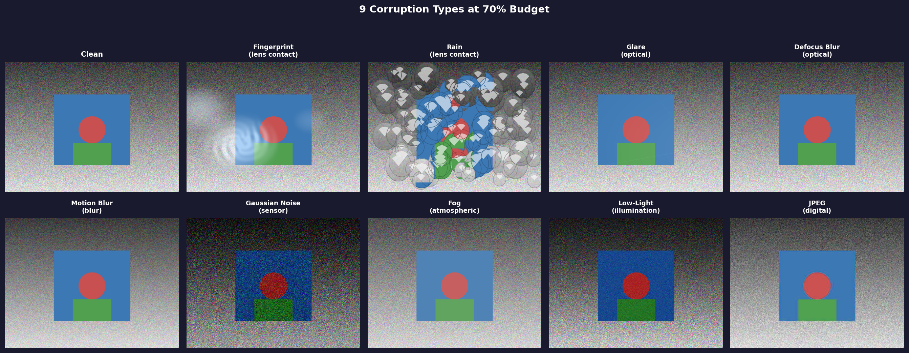
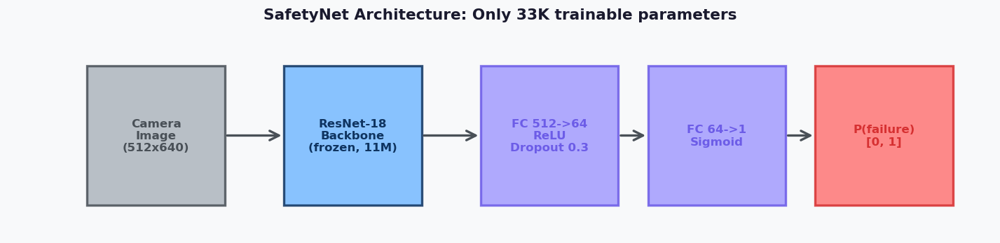
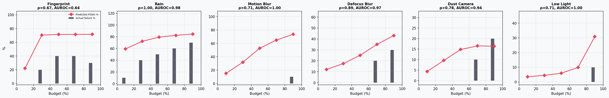
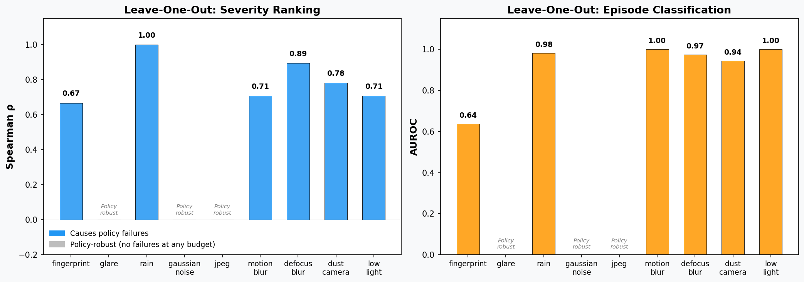

# Robot-Arm-SOTIF

**Can a lightweight visual safety monitor predict when camera corruption will cause a robot to fail — even for corruption types it has never seen?**

[Paper (RA-L, in preparation)]() | [Results](results/loo_analysis_v3/loo_summary.json)

---

## The Task

A vision-language-action model ([InternVLA-M1](https://github.com/OpenGVLab/InternVLA)) picks up a coke can from a table in simulation ([SimplerEnv](https://github.com/simpler-env/SimplerEnv) / SAPIEN). The coke can starts at a **random position** each episode. Under clean conditions, the policy achieves 100% success rate (50/50 episodes).

<p align="center">
  
</p>

The question: what happens when the camera lens is dirty, wet, or otherwise degraded?

## Camera Corruption Types

We test 9 corruption types spanning 6 physical mechanisms, following the [ImageNet-C](https://arxiv.org/abs/1903.12261) taxonomy adapted for fixed-mount robot cameras:

<p align="center">
  
</p>

| Category | Corruption | Source | Causes failures? |
|---|---|---|:---:|
| Lens contact | Fingerprint smudge | Gu et al., SIGGRAPH Asia 2009 | Yes (high budget) |
| Lens contact | Rain drops | camera_occlusion | Yes |
| Optical | Glare / lens flare | Physically-inspired | No |
| Optical | Defocus blur | ImageNet-C | Yes (high budget) |
| Blur | Motion blur | ImageNet-C | Yes (high budget) |
| Sensor | Gaussian noise | ImageNet-C | No |
| Environmental | Dust / mud | camera_occlusion | Yes (high budget) |
| Illumination | Low-light | LIBERO-Plus | Yes (high budget) |
| Digital | JPEG compression | ImageNet-C | No |

Each corruption has a **budget level** (0–100%) controlling severity. Budgets are tuned per type to target the regime where failures occur — some corruption types require higher severity to impact the policy.

Here is rain at 50% budget — the policy fails 40% of the time. Each animation shows 10 real episodes where the policy sees the corrupted frames, with a real-time P(failure) prediction from the safety monitor and a running success counter:

<p align="center">
  
</p>

And defocus blur at 90% budget:

<p align="center">
  
</p>

> The P(failure) gauge shows predictions from a model trained **without** the displayed corruption type — fully out-of-distribution. [All 10 animations available as GIF + MP4.](results/demo_episodes_v2/)

## Safety Predictor

We train a lightweight CNN to predict P(failure) from a single camera frame — the occluded image the policy actually sees, with no knowledge of the corruption type, budget, or parameters.

<p align="center">
  
</p>

**Architecture:** Frozen ResNet-18 backbone (ImageNet-pretrained, 11M params) + trainable head (33K params): `512 → FC(64) → ReLU → Dropout(0.3) → FC(1) → sigmoid`.

**Key insight:** The frozen backbone provides corruption-agnostic visual features — edges, textures, contrast, sharpness — that degrade in recognizable ways regardless of the physical corruption mechanism. Only the 33K-parameter head learns what degradation patterns lead to task failure.

## In-Distribution Performance

When trained and evaluated on the **same** corruption types, the predictor accurately ranks severity by predicted failure probability:

<p align="center">
  
</p>

## Out-of-Distribution Generalization (Leave-One-Out)

The critical question: **can the predictor generalize to corruption types it has never seen?**

We run a leave-one-out (LOO) analysis: for each of the 9 corruption types, hold it out entirely, train on the other 8, and evaluate on the held-out type.

<p align="center">
  
</p>

| Held-out Type | Category | Spearman ρ | p-value | AUROC |
|---|---|:---:|:---:|:---:|
| Rain | Lens contact | **1.000** | 0.000 | 0.981 |
| Defocus blur | Optical | **0.894** | 0.041 | 0.973 |
| Dust / mud | Environmental | **0.783** | 0.118 | 0.943 |
| Motion blur | Blur | **0.707** | 0.182 | 1.000 |
| Low-light | Illumination | **0.707** | 0.182 | 1.000 |
| Fingerprint | Lens contact | 0.667 | 0.219 | 0.636 |

**Result:** On the 6 corruption types that cause failures, the monitor achieves **mean Spearman ρ = 0.793 ± 0.118** for severity ranking and **mean AUROC = 0.922 ± 0.129** for episode-level failure classification — even though the held-out corruption was never seen during training.

For comparison, a CNN trained from scratch (no ImageNet pretraining) achieves ρ = -0.62 on held-out rain — **anti-correlated**. The frozen pretrained backbone is the key.

## Reproducing Results

### Requirements

- GPU machine with CUDA (experiments run on [vast.ai](https://vast.ai) RTX 4090 instances)
- [pixi](https://pixi.sh) for local dependency management

<details>
<summary>Full LOO pipeline (GPU required)</summary>

```bash
# On vast.ai with nvidia/vulkan:1.3-470 image:
bash scripts/setup_nvvulkan.sh

# Start InternVLA-M1 server
cd /root/InternVLA-M1
PYTHONPATH=/root/InternVLA-M1 python deployment/model_server/server_policy_M1.py \
  --ckpt_path /root/internvla_m1_ckpt/checkpoints/steps_50000_pytorch_model.pt \
  --port 10093 --use_bf16 &
sleep 60

# Run LOO analysis
cd /root/project
PYTHONPATH=/root/InternVLA-M1:/root/project:/root/camera_occlusion \
  python -u adversarial_dust/run_safety_predictor.py \
  --config configs/safety_predictor.yaml \
  --loo \
  --loo-types fingerprint glare rain gaussian_noise jpeg \
             motion_blur defocus_blur dust_camera low_light \
  --eval-episodes 10 \
  --episodes-per-condition 10 \
  --output-dir results/loo_analysis

# Record demo animations
python scripts/record_demo_episodes.py \
  --config configs/safety_predictor.yaml \
  --episodes 10 \
  --loo-dir results/loo_analysis
```
</details>

### Generate figures locally

```bash
PYTHONPATH=camera_occlusion:. pixi run python scripts/generate_paper_figures.py \
  --results-dir results/loo_analysis \
  --output-dir docs/figures
```

## SOTIF Context

[SOTIF (ISO 21448)](https://www.iso.org/standard/77490.html) addresses safety of the intended functionality — failures from limitations of perception, not hardware faults. Camera corruption is a canonical SOTIF triggering condition for vision-based systems.

This project demonstrates that a lightweight safety monitor can detect degraded perception and **generalize across corruption types** using pretrained visual features, reducing the need for corruption-specific safety validation.

## Citation

```bibtex
@article{quick2026crosscorruption,
  title={Cross-Corruption Safety Monitoring for Vision-Based Robot Manipulation
         via Adversarial Envelope Analysis},
  author={Quick, Julian},
  journal={IEEE Robotics and Automation Letters},
  year={2026},
  note={In preparation}
}
```
