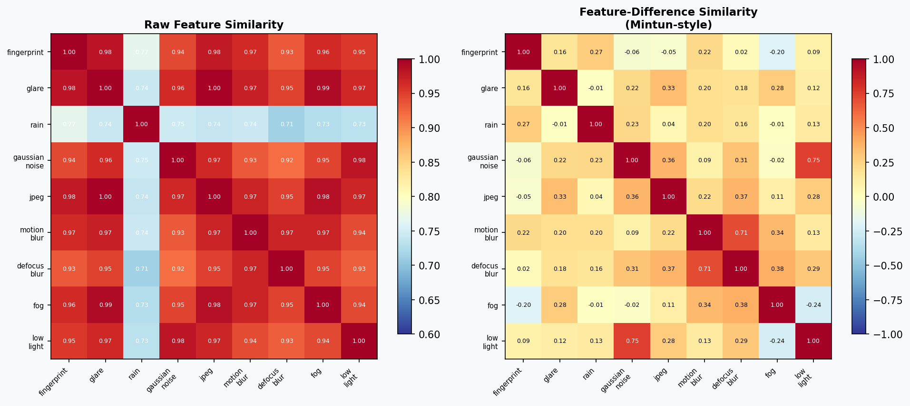

# Robot-Arm-SOTIF

**Can a lightweight visual safety monitor predict when camera corruption will cause a robot to fail — even for corruption types it has never seen?**

[Paper (RA-L, in preparation)]() | [Results](results/loo_analysis/loo_summary.json)

---

## The Task

A vision-language-action model ([InternVLA-M1](https://github.com/OpenGVLab/InternVLA)) picks up a coke can from a table in simulation ([SimplerEnv](https://github.com/simpler-env/SimplerEnv) / SAPIEN). The coke can starts at a **random position** each episode. Under clean conditions, the policy achieves 100% success rate (50/50 episodes).

The question: what happens when the camera lens is dirty, wet, or otherwise degraded?

## Camera Corruption Types

We test 9 corruption types spanning 6 physical mechanisms, following the [ImageNet-C](https://arxiv.org/abs/1903.12261) taxonomy adapted for fixed-mount robot cameras:

<p align="center">
  
</p>

| Category | Corruption | Source | Causes failures? |
|---|---|---|:---:|
| Lens contact | Fingerprint smudge | Gu et al., SIGGRAPH Asia 2009 | Yes |
| Lens contact | Rain drops | camera_occlusion | Yes |
| Optical | Glare / lens flare | Physically-inspired | No |
| Optical | Defocus blur | ImageNet-C | Yes |
| Blur | Motion blur | ImageNet-C | Yes |
| Sensor | Gaussian noise | ImageNet-C | No |
| Environmental | Dust / mud | camera_occlusion | TBD |
| Illumination | Low-light | LIBERO-Plus | Yes |
| Digital | JPEG compression | ImageNet-C | No |

Each corruption is parameterized with a **budget level** (0-100%) controlling severity. At each budget, we sample random corruption parameters and run episodes to measure success rate.

Notably, InternVLA-M1 is **completely robust** to glare, Gaussian noise, and JPEG compression — even at 90% budget, the policy still succeeds. The remaining corruption types cause increasing failure rates as severity grows.

## Feature-Space Similarity

How similar do these corruptions look to a pretrained neural network? We pass corrupted images through a frozen ResNet-18 backbone and measure pairwise cosine similarity between corruption types in the 512-dimensional feature space.

<p align="center">
  
</p>

**Left:** Raw feature similarity — how close each corruption's feature centroid is to the others. Most corruptions cluster tightly (cosine sim > 0.9), but rain is an outlier (sim ≈ 0.74) due to its strong local distortions.

**Right:** Feature-difference similarity ([Mintun et al., NeurIPS 2021](https://arxiv.org/abs/2102.11273)) — cosine similarity between the *directions* corruptions push features away from clean. This measures whether corruptions perturb the representation in similar ways. Low similarity (< 0.3) means corruptions affect the network's internal representation differently.

## Safety Predictor

We train a lightweight CNN to predict P(failure) from a single camera frame — the occluded image the policy actually sees, with no knowledge of the corruption type, budget, or parameters.

<p align="center">
  
</p>

**Architecture:** Frozen ResNet-18 backbone (ImageNet-pretrained, 11M params) + trainable head (33K params): `512 → FC(64) → ReLU → Dropout(0.3) → FC(1) → sigmoid`.

**Training data:** Episodes collected under various corruption types and budget levels, labeled with success/failure. Trained with class-weighted BCE loss and episode-level train/val split to prevent data leakage from temporally correlated frames.

**Key insight:** The frozen backbone provides corruption-agnostic visual features — edges, textures, contrast, sharpness — that degrade in recognizable ways regardless of the physical corruption mechanism. Only the 33K-parameter head needs to learn what degradation patterns lead to task failure.

## In-Distribution Performance

When the safety predictor is trained and evaluated on the **same** corruption types, it accurately ranks corruption severity by predicted failure probability:

<p align="center">
  
</p>

As the corruption budget increases, both actual failure rate and predicted P(failure) increase monotonically. The predictor tracks the dose-response curve across all failure-inducing corruption types.

## Out-of-Distribution Generalization (Leave-One-Out)

The critical question: **can the predictor generalize to corruption types it has never seen?**

We run a leave-one-out (LOO) analysis: for each of the 9 corruption types, hold it out entirely, train on the other 8, and evaluate on the held-out type. This tests whether the frozen backbone's corruption-agnostic features transfer across physical mechanisms.

<p align="center">
  
</p>

| Held-out Type | Category | Spearman rho | p-value | AUROC |
|---|---|:---:|:---:|:---:|
| Fingerprint | Lens contact | **0.975** | 0.005 | 0.771 |
| Rain | Lens contact | **0.975** | 0.005 | 0.931 |
| Motion blur | Blur | **0.894** | 0.041 | 0.943 |
| Defocus blur | Optical | **0.866** | 0.058 | 0.929 |
| Low-light | Illumination | **0.707** | 0.182 | 1.000 |

**Result:** On the 5 corruption types that cause failures, the monitor achieves **mean Spearman rho = 0.883 ± 0.098** for severity ranking and **mean AUROC = 0.915 ± 0.076** for episode-level failure classification — even though the held-out corruption was never seen during training.

For comparison, a CNN trained from scratch (no ImageNet pretraining) achieves rho = -0.62 on held-out rain — **anti-correlated**. The frozen pretrained backbone is the key.

## Reproducing Results

### Requirements

- GPU machine with CUDA (experiments run on [vast.ai](https://vast.ai) RTX 4090 instances)
- [pixi](https://pixi.sh) for local dependency management

### Full LOO pipeline (GPU required)

<details>
<summary>GPU setup and execution</summary>

```bash
# On vast.ai with nvidia/vulkan:1.3-470 image:
bash scripts/setup_nvvulkan.sh

# Start InternVLA-M1 server
cd /root/InternVLA-M1
PYTHONPATH=/root/InternVLA-M1 python deployment/model_server/server_policy_M1.py \
  --ckpt_path /root/internvla_m1_ckpt/checkpoints/steps_50000_pytorch_model.pt \
  --port 10093 --use_bf16 &
sleep 60

# Run LOO analysis
cd /root/project
PYTHONPATH=/root/InternVLA-M1:/root/project:/root/camera_occlusion \
  python -u adversarial_dust/run_safety_predictor.py \
  --config configs/safety_predictor.yaml \
  --loo \
  --loo-types fingerprint glare rain gaussian_noise jpeg \
             motion_blur defocus_blur dust_camera low_light \
  --eval-episodes 10 \
  --episodes-per-condition 10 \
  --output-dir results/loo_analysis
```
</details>

### Generate figures locally

```bash
PYTHONPATH=camera_occlusion:. pixi run python scripts/generate_paper_figures.py \
  --results-dir results/loo_analysis \
  --output-dir docs/figures
```

## SOTIF Context

[SOTIF (ISO 21448)](https://www.iso.org/standard/77490.html) addresses safety of the intended functionality — failures from limitations of perception, not hardware faults. Camera corruption is a canonical SOTIF triggering condition for vision-based systems.

This project demonstrates that a lightweight safety monitor can detect degraded perception and **generalize across corruption types** using pretrained visual features, reducing the need for corruption-specific safety validation.

## Citation

```bibtex
@article{quick2026crosscorruption,
  title={Cross-Corruption Safety Monitoring for Vision-Based Robot Manipulation
         via Adversarial Envelope Analysis},
  author={Quick, Julian},
  journal={IEEE Robotics and Automation Letters},
  year={2026},
  note={In preparation}
}
```
